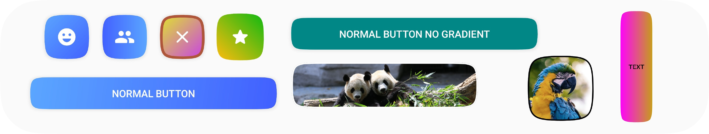

<h1 align="center">SquircleView</h1></br>
<p align="center"></p>
<p align="center">SquircleView is a library which provides you with Squircle views to use for buttons, views, etc.</p>

<br/>

<p align="center">
  <a href="https://opensource.org/licenses/MIT"></a>
  <a href="https://android-arsenal.com/api?level=23"></a>
  <a></a>
<!--  <a></a> -->
  <a></a>
  <a></a>
  <a></a>
</p>

## Screenshots

Different kinds of buttons, layouts and images you can create
<p>

</p>

---

## Table of Contents

1. [How to use](#how-to-use)
2. [Usage](#usage)
    1. [SquircleImageView](#squircleimageview)
    2. [SquircleButton](#squirclebutton)
    3. [SquircleConstraintLayout](#squircleconstraintlayout)
    4. [Load image](#load-image)
    5. [Attributes](#attributes)
    6. [Methods](#methods)
3. [Android Shapes](#android-shapes)
    1. [ShapeAppearance](#shapeappearance)
    2. [ShapeDrawable](#shapedrawable)
    3. [Methods and classes](#methods-and-classes)
4. [Todo](#todo)
5. [Contributing](#contributing)
6. [Contributors](#contributors)
7. [Showcase](#showcase)
8. [Changelog](#changelog)
9. [Attribution](#attribution)
10. [License](#license)

---

## How to use

<a></a>
<!--<a></a>-->
<!--<a></a>-->

Add the Maven repository to your root build.gradle file:

```groovy
allprojects {
    repositories {
        mavenCentral()
    }
}
```

Also add the SquircleView dependency to your app build.gradle

```groovy
dependencies {
    implementation "app.juky:squircleview:0.0.3"
}
```

## Usage

For all use cases, check out the [sample](/sample) app which contains a bunch of different configurations.

#### SquircleImageView

This view extends the `AppCompatImageView`, which you can use to have a squircle image.

```xml

<squircleview.views.SquircleImageView
	android:id="@+id/imageButton"
	android:layout_width="100dp"
	android:layout_height="100dp"
	app:squircle_background_color="#FF00FF"
	app:squircle_background_image="@drawable/first_image"
	app:squircle_border_color="#000000"
	app:squircle_border_width="4dp"/>
```

#### SquircleButton

This view extends the `AppCompatTextView`, which you can use to have a squircle button

```xml

<squircleview.views.SquircleButton
	android:id="@+id/normalButton"
	android:layout_width="match_parent"
	android:layout_height="wrap_content"
	android:padding="16dp"
	android:text="Normal button"
	android:textColor="#FFFFFF"
	app:squircle_gradient_end_color="#415FFF"
	app:squircle_gradient_start_color="#5BA7FF"
	app:squircle_shadow_elevation="2dp"/>
```

#### SquircleConstraintLayout

This view extends the `ConstraintLayout`, which you can use to add all sorts of view to your squircle, like an icon or a
complex layout with texts and icons.

````xml

<squircleview.views.SquircleConstraintLayout
	android:layout_width="72dp"
	android:layout_height="72dp"
	android:padding="16dp"
	app:squircle_gradient_end_color="#415FFF"
	app:squircle_gradient_start_color="#5BA7FF"
	app:squircle_shadow_elevation="2dp">

	<!-- Embed whatever widget you would like, in this case an icon -->
	<androidx.appcompat.widget.AppCompatImageView
		android:layout_width="32dp"
		android:layout_height="32dp"
		android:src="@drawable/ic_emoji"
		android:tint="@color/white"
		app:layout_constraintBottom_toBottomOf="parent"
		app:layout_constraintEnd_toEndOf="parent"
		app:layout_constraintStart_toStartOf="parent"
		app:layout_constraintTop_toTopOf="parent"/>

</squircleview.views.SquircleConstraintLayout>
````

#### Load image

You can load an image in every view using the `setBackgroundImage` method, but you can also use your favorite image loading
library to load it in for you. We have out of the box support for Glide, Picasso, Fresco, Coil, etc.

##### Load image normally

```kotlin
my_squircle_image_view.setBackgroundImage(ContextCompat.getDrawable(context, R.drawable.my_image))
```

##### Load image using an image loading library like Glide:

```kotlin
Glide.with(this).load(R.drawable.my_image)
	.diskCacheStrategy(DiskCacheStrategy.ALL)
	.into(my_squircle_image_view)
```

### Attributes

| Attribute                       | Type      | Default                            | Description                                             |
|---------------------------------|-----------|------------------------------------|---------------------------------------------------------|
| squircle_background_image       | reference |                                    | Background image of view                                |
| squircle_background_color       | color     | #000000                            | Background color of view                                |
| squircle_gradient_drawable      | reference |                                    | Gradient drawable displayed in view                     |
| squircle_gradient_start_color   | color     |                                    | Gradient start color                                    |
| squircle_gradient_end_color     | color     |                                    | Gradient end color                                      |
| squircle_gradient_direction     | enum      | TOP_LEFT_BOTTOM_RIGHT              | Direction of the gradient (only for the color gradient) |
| squircle_shadow_elevation       | dimension | Default of the super view          | Shadow elevation                                        |
| squircle_shadow_elevation_color | color     | #42000000                          | Shadow elevation color                                  |
| squircle_border_color           | color     |                                    | Border color                                            |
| squircle_border_width           | dimension | 0                                  | Border width                                            |
| squircle_ripple_enabled         | boolean   | true (false for SquircleImageView) | Ripple enabled or disabled                              |

### Methods

Properties of the views can be modified by setting using following variables / methods. They can be accessed via the `style` property of the view. Note: Only supply color resources to the variables with the suffix `Res`, otherwise your colors won't work.

```kotlin
// Property getters / setters
var backgroundImage: Bitmap?
var backgroundColor: Int
var backgroundColorRes: Int
var shadowElevation: Float
var shadowElevationColor: Int
var shadowElevationColorRes: Int
var gradientDrawable: GradientDrawable?
var gradientStartColor: Int
var gradientStartColorRes: Int
var gradientEndColor: Int
var gradientEndColorRes: Int
var gradientDirection: GradientDirection
var borderColor: Int
var borderColorRes: Int
var borderWidth: Float
var rippleEnabled: Boolean

// Methods
fun setBackgroundImage(drawable: Drawable?)
fun setBackgroundImage(resId: Int)
fun setGradientDrawable(resId: Int)
fun setGradientDirection(angle: Int)
```

#### Example:
```
val button = findViewById<SquircleButton>(R.id.button)
button.style.backgroundColor = Color.RED
button.style.backgroundColorRes = R.color.teal_200
```

## Android Shapes

As you might have encountered before, Android does support
custom [Shapes](https://material.io/design/shape/about-shape.html#shaping-material) to be applied to buttons, images,
ConstraintLayout, etc. I've decided to create a custom view to allow some flexibility when it comes to using gradients
and other functionalities which don't work really well with shapes. If you would still like to use a ShapeDrawable /
ShapeAppearance, I've decided to add this functionality to the library. Please note that this is only supported
programmatically, not via XML.

### ShapeAppearance

```kotlin
binding.buttonWithShapeDrawable.shapeAppearanceModel = SquircleShape.getShapeAppearance().build()
```

### ShapeDrawable

```kotlin
// The background color is not preserved, so it needs to be re-applied
binding.constraintLayoutWithShapeDrawable.background =
	SquircleShape.getShapeDrawable(binding.constraintLayoutWithShapeDrawable).apply {
		this.paint.apply {
			this.color = ContextCompat.getColor(this, R.color.my_color)
		}
	}
```

### Methods and classes

#### Methods

```kotlin
// Methods derived from SquircleShape
fun getSquirclePath(rect: RectF, width: Int, height: Int): ShapePath
fun getShapeAppearance(): ShapeAppearanceModel.Builder
fun getShapeDrawable(view: View): ShapeDrawable
```

#### Classes

If you would like to apply the Squircle to only a certain corner or such, you can retrieve the custom CutCornerTreatment
implementation, which is called `SquircleCornerTreatment`.

## Todo

- [ ] Inner shadow support
- [ ] Layouts other than ConstraintLayout
- [X] Expose all attributes via methods
- [ ] Ensure it works on API 21 - 30
- [ ] Check Java support
- [ ] Performance testing with lots of bitmaps
- [ ] Add tests
- [ ] Code documentation
- [ ] Option to determine text color by background / image
- [ ] Use precise angle of gradient instead of matching it to a segment
- [ ] Improve outer shadow boundaries
- [ ] Jetpack compose support

## Contributing

Check out the [CONTRIBUTING.md](CONTRIBUTING.md) file to know more

## Contributors

<table>
<tr>
    <td align="center">
        <a href="https://github.com/Nielssg">
            <br />
            <sub><b>Niels G</b></sub>
        </a>
        <br />
        <a href="https://github.com/Juky-App/SquircleView/commits?author=DemianD" title="Code">💻</a>
        <a href="https://github.com/Juky-App/SquircleView/commits?author=nielssg" title="Documentation">📖</a>
        <a href="#" title="Maintenance">🚧</a>
    </td>
    <td align="center">
        <a href="https://github.com/ThomasBakker">
            <br />
            <sub><b>Thomas Bakker</b></sub>
        </a>
        <br />
        <a href="https://github.com/Juky-App/SquircleView/pulls?q=is%3Apr+reviewed-by%3thomasbakker" title="Reviewed Pull Requests">👀</a>
    </td>
</tr>

</table>

## Showcase

<!-- TODO OWN APP -->

## Changelog

- V0.0.3 (19 june 2021)
    - Added support for programmatically setting the view's properties
- V0.0.2 (12 june 2021):
    - Added support for Android shapes
    - Fixed Maven using the wrong source url
- V0.0.1 (10 june 2021):
    - Initial release

## Attribution

Images used in the sample app originate from Unsplash:

- [Llama](https://unsplash.com/photos/CAjfBVgaMZ4)
- [Parrot](https://unsplash.com/photos/lylCw4zcA7I)
- [Panda](https://unsplash.com/photos/lJYi_7NUe04)

This library is inspired by the [cupertino_rounded_corners](https://pub.dev/packages/cupertino_rounded_corners) Flutter
library

## License

```
MIT License

Copyright (c) 2021] Juky

Permission is hereby granted, free of charge, to any person obtaining a copy
of this software and associated documentation files (the "Software"), to deal
in the Software without restriction, including without limitation the rights
to use, copy, modify, merge, publish, distribute, sublicense, and/or sell
copies of the Software, and to permit persons to whom the Software is
furnished to do so, subject to the following conditions:

The above copyright notice and this permission notice shall be included in all
copies or substantial portions of the Software.

THE SOFTWARE IS PROVIDED "AS IS", WITHOUT WARRANTY OF ANY KIND, EXPRESS OR
IMPLIED, INCLUDING BUT NOT LIMITED TO THE WARRANTIES OF MERCHANTABILITY,
FITNESS FOR A PARTICULAR PURPOSE AND NONINFRINGEMENT. IN NO EVENT SHALL THE
AUTHORS OR COPYRIGHT HOLDERS BE LIABLE FOR ANY CLAIM, DAMAGES OR OTHER
LIABILITY, WHETHER IN AN ACTION OF CONTRACT, TORT OR OTHERWISE, ARISING FROM,
OUT OF OR IN CONNECTION WITH THE SOFTWARE OR THE USE OR OTHER DEALINGS IN THE
SOFTWARE.
```
